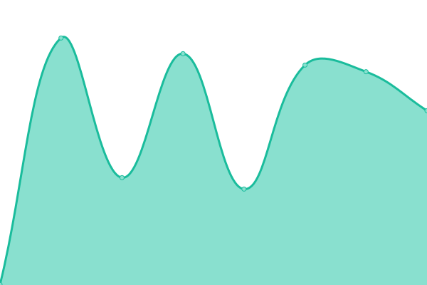
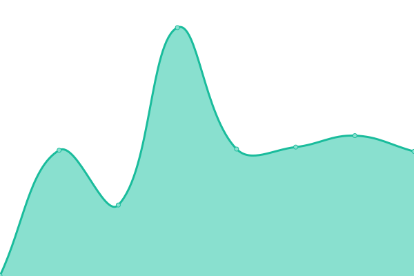

# [📈 Live Status](https://LACMTA.github.io/uptime): <!--live status--> **🟩 All systems operational**

This repository contains the open-source uptime monitor and status page for [Metro](https://metro.net), powered by [Upptime](https://github.com/upptime/upptime).

With [Upptime](https://upptime.js.org), you can get your own unlimited and free uptime monitor and status page, powered entirely by a GitHub repository. We use [Issues](https://github.com/LACMTA/uptime/issues) as incident reports, [Actions](https://github.com/LACMTA/uptime/actions) as uptime monitors, and [Pages](https://LACMTA.github.io/uptime) for the status page.

<!--start: status pages-->
<!-- This summary is generated by Upptime (https://github.com/upptime/upptime) -->
<!-- Do not edit this manually, your changes will be overwritten -->
<!-- prettier-ignore -->
| URL | Status | History | Response Time | Uptime |
| --- | ------ | ------- | ------------- | ------ |
|  [Metro.net](https://metro.net/) | 🟩 Up | [metro-net.yml](https://github.com/LACMTA/uptime/commits/HEAD/history/metro-net.yml) | 

 1128ms
     
 | 

<a href="https://LACMTA.github.io/uptime/history/metro-net">100.00%</a>
    

|  [Metro API](https://api.metro.net) | 🟩 Up | [metro-api.yml](https://github.com/LACMTA/uptime/commits/HEAD/history/metro-api.yml) | 

 436ms
     
 | 

<a href="https://LACMTA.github.io/uptime/history/metro-api">100.00%</a>
    

|  [Metro Time Tables API](https://timetables.metroservices.io/api/v1) | 🟩 Up | [metro-time-tables-api.yml](https://github.com/LACMTA/uptime/commits/HEAD/history/metro-time-tables-api.yml) | 

 348ms
     
 | 

<a href="https://LACMTA.github.io/uptime/history/metro-time-tables-api">100.00%</a>
    

|  [Swiftly API](https://transitime-api.goswift.ly/api/v1/key/81YENWXv/agency/lametro/command/agency) | 🟩 Up | [swiftly-api.yml](https://github.com/LACMTA/uptime/commits/HEAD/history/swiftly-api.yml) | 

 256ms
     
 | 

<a href="https://LACMTA.github.io/uptime/history/swiftly-api">100.00%</a>
    

|  [Swiftly Bus Arrivals Map](https://live.goswift.ly/lametro/) | 🟩 Up | [swiftly-bus-arrivals-map.yml](https://github.com/LACMTA/uptime/commits/HEAD/history/swiftly-bus-arrivals-map.yml) | 

 163ms
     
 | 

<a href="https://LACMTA.github.io/uptime/history/swiftly-bus-arrivals-map">100.00%</a>
    

|  [Swiftly Rail Arrivals Map](https://live.goswift.ly/lametro-rail/) | 🟩 Up | [swiftly-rail-arrivals-map.yml](https://github.com/LACMTA/uptime/commits/HEAD/history/swiftly-rail-arrivals-map.yml) | 

 63ms
     
 | 

<a href="https://LACMTA.github.io/uptime/history/swiftly-rail-arrivals-map">100.00%</a>
    

<!--end: status pages-->

[**Visit our status website →**](https://LACMTA.github.io/uptime)

## 📄 License

- Powered by: [Upptime](https://github.com/upptime/upptime)
- Code: [MIT](./LICENSE) © [Metro](https://metro.net)
- Data in the `./history` directory: [Open Database License](https://opendatacommons.org/licenses/odbl/1-0/)
